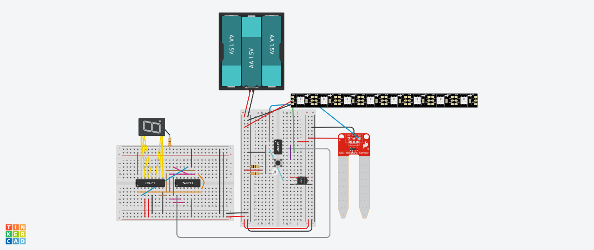

# ATtiny plant monitoring system prototype
Even though the number of pins on the ATtiny is very limited, it still allows us to create a simple plant monitoring system with several modes.

The schema is provided in the PDF file. C++ code is available in tiny_monitor.cpp
## Modes
There are 5 modes that user can change using a button provided. This adjusts a normal moisture level depending on a plant type. 
One 7-segment display is used for a mode indication. 
4-bit binary counter and 7-segment decoder are combined to minimize the number of pins used in ATTiny.
* Mode 0 - suitable for succulents and cactuses (normal moisture level is 5-15%)
* Mode 1 - suitable for most flowers and ornamental shrubs (normal moisture level is 15-30%)
* Mode 2 - suitable for berries, fruiting vegetables and root vegetables (normal moisture level is 30-45%)
* Mode 3 - suitable for leafy vegetables and grain crops (normal moisture level is 45-65%)
* Mode 4 - suitable for bog plants, aquatic plants, and wetland plants (normal moisture level is 65-85%)

## Sensors
* Soil moisture sensor is used to monitor the moisure level of a plant and indicate user if their plant has to be watered.
* Ambient light sensor is used to show user the level of brightness in the environment where the plant is located.
* Temperature sensor is used to make sure the temperature is within the acceptable range.

## Indicators
A neopixel strip of 8 pixels is used for indication of all sensor values.
> Note, you can adjust all the threshold to make the project suitable for your own needs and environments.
### First pixel
First pixel (from the left) indicates the level of moisture in the soil, depending on the mode selected.
If it is within an acceptable range (for example, in mode 0 it would be 5-15%), the pixel appears in green.
If the soil is too dry and plant has to watered, the pixel is lit up in red.
If the soil is too wet, the pixel appears in blue.
### Second pixel
Second pixel indicates the temperature level. The pixel is green if the temperature is within the normal range (10-40°C).
If the temperature is too low, the pixel appears in blue.
If the temperature is too high, the pixel appears in red.
### Pixels 3-8
All other pixels are used to indicate a brightness level on a scale of 6. All the pixels are lit up in purple, the number of pixels indicates the brightness level, with 0 being the lowest and 6 the highest.
